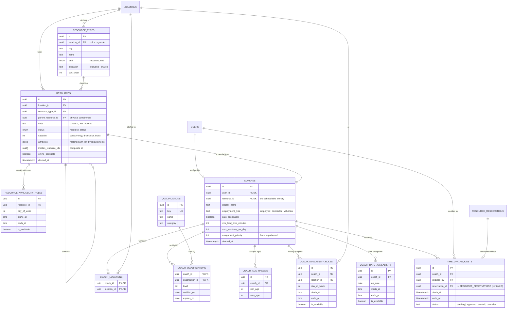
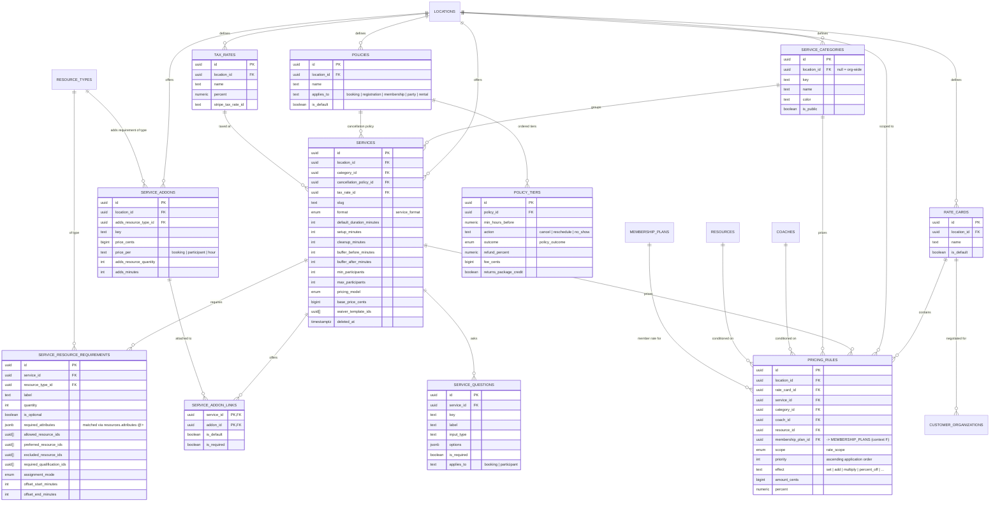
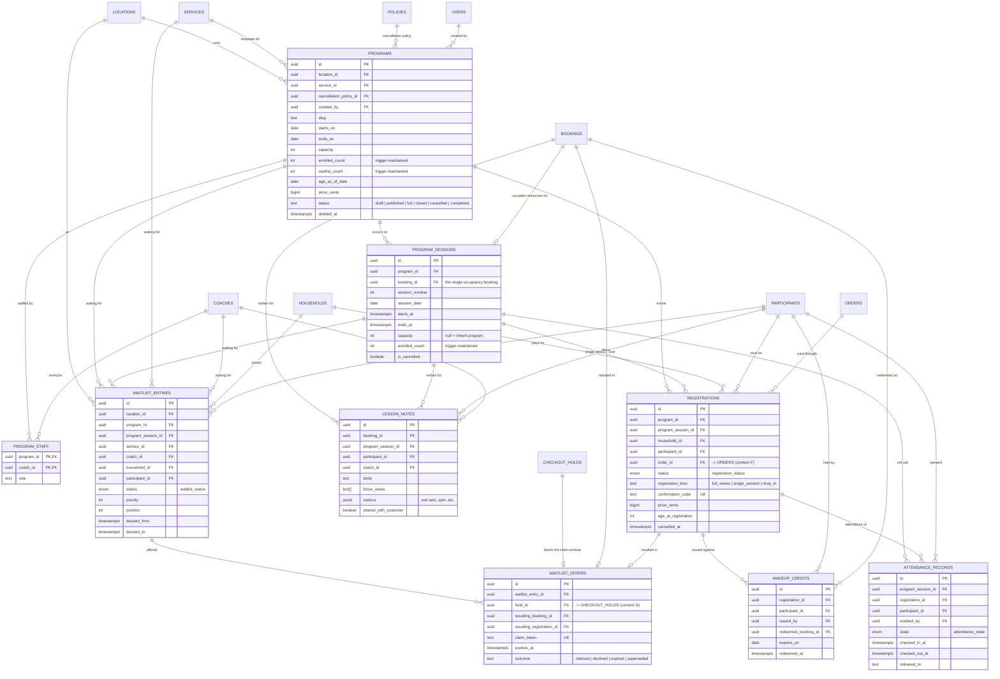

# ATD Platform — Entity Relationship Diagrams

Source of truth: `supabase/migrations/0001` through `supabase/migrations/0011`. The
schema contains 94 base tables plus one view (`atd.participants_safe`) in the `atd`
schema, and one append-only table (`audit.entries`) in the `audit` schema.

The diagrams below are split into seven bounded contexts. Foreign keys that cross a
context boundary are drawn in the diagram where the *child* table lives; the parent
entity is shown without its attribute list in that case, and appears in full in its
own context.

Attribute lists are deliberately partial — each entity shows its primary key,
foreign keys, and the columns that carry business meaning. Consult
`DATA_DICTIONARY.md` and the migration files for the full column set.

Conventions used throughout the schema:

- All identifiers are `uuid` with `gen_random_uuid()` defaults, except
  `atd.stripe_events.id` (the Stripe event id, `text`) and `audit.entries.id`
  (`bigint` identity).
- All instants are `timestamptz`. Wall-clock intent (operating hours, availability
  rules, recurrence anchors) is stored as local `date`/`time` plus an IANA timezone
  on the location.
- All money is integer cents (`bigint`, and the domains `atd.cents` /
  `atd.signed_cents`).
- Domains: `atd.email` (validated `citext`), `atd.phone_e164` (validated `text`).

---

## A. Identity, RBAC & Locations

The root of the graph. An `organizations` row owns one or more `locations`; almost
every other table in the system is scoped to a location. `users` mirrors Supabase
`auth.users` one-to-one through `auth_user_id` and never stores credentials.

Authorisation is three-layered: `permissions` are string keys, `roles` bundle them
through `role_permissions`, and `user_roles` grants a role to a user *at a location*
(a `NULL` `location_id` means org-wide, which is how `super_admin` is expressed).
`user_permission_overrides` grants or denies a single capability outside the role
bundle, with deny winning over allow.

The customer side of identity also lives here. A `households` row is the billing and
booking unit; adults attach through `household_members` and children through
`participants`. `customer_organizations` covers travel teams, schools and corporate
accounts, with `teams` and `team_roster_entries` beneath them. Operating hours are
modelled as a weekly template (`operating_hour_sets` → `operating_hours`) with
single-date exceptions in `date_overrides`.

```mermaid
erDiagram
    ORGANIZATIONS {
        uuid id PK
        text name
        text legal_name
        text default_timezone
        jsonb branding
    }
    LOCATIONS {
        uuid id PK
        uuid organization_id FK
        text slug UK
        text name
        text timezone
        boolean is_active
        jsonb settings "checkout_hold_minutes, lead time, horizon"
        timestamptz deleted_at
    }
    OPERATING_HOUR_SETS {
        uuid id PK
        uuid location_id FK
        text name
        date effective_from
        date effective_to
        int priority "higher wins on overlap"
        boolean is_default
    }
    OPERATING_HOURS {
        uuid id PK
        uuid hour_set_id FK
        int day_of_week "0 = Sunday"
        time opens_at
        time closes_at
        boolean is_closed
    }
    DATE_OVERRIDES {
        uuid id PK
        uuid location_id FK
        uuid created_by FK
        date on_date
        boolean is_closed
        time opens_at
        time closes_at
        text label
    }
    USERS {
        uuid id PK
        uuid auth_user_id UK "supabase auth.users.id"
        email email UK
        phone_e164 phone
        text display_name "generated: first + last"
        enum status "user_status"
        timestamptz sms_consent_at "TCPA provenance"
        timestamptz deleted_at
    }
    PERMISSIONS {
        text key PK
        text category
        text description
    }
    ROLES {
        uuid id PK
        enum key UK "role_key"
        text name
        boolean is_system
    }
    ROLE_PERMISSIONS {
        uuid role_id PK,FK
        text permission_key PK,FK
    }
    USER_ROLES {
        uuid id PK
        uuid user_id FK
        uuid role_id FK
        uuid location_id FK "null = all locations"
        uuid granted_by FK
        timestamptz revoked_at
    }
    USER_PERMISSION_OVERRIDES {
        uuid id PK
        uuid user_id FK
        uuid location_id FK
        text permission_key FK
        text effect "allow | deny"
        uuid created_by FK
    }
    HOUSEHOLDS {
        uuid id PK
        uuid location_id FK
        uuid primary_user_id FK
        text name
        text stripe_customer_id UK
        bigint account_credit_cents "mirror of ledger"
        bigint balance_due_cents
        timestamptz deleted_at
    }
    HOUSEHOLD_MEMBERS {
        uuid id PK
        uuid household_id FK
        uuid user_id FK
        text relationship
        boolean can_book
        boolean can_pay
        boolean is_primary
    }
    PARTICIPANTS {
        uuid id PK
        uuid household_id FK
        uuid user_id FK "set when an adult books for self"
        text first_name
        text last_name
        date date_of_birth
        enum sport
        text allergies "sensitive"
        text medical_notes "sensitive"
        timestamptz deleted_at
    }
    PARTICIPANTS_SAFE {
        uuid id PK
        uuid household_id FK
        text first_name
        text last_name
        text allergies "redacted without participant.read_medical"
        text medical_notes "redacted without participant.read_medical"
        int age "computed via atd.age_on"
    }
    EMERGENCY_CONTACTS {
        uuid id PK
        uuid household_id FK
        uuid participant_id FK
        text name
        phone_e164 phone
        int priority
    }
    AUTHORIZED_PICKUPS {
        uuid id PK
        uuid household_id FK
        uuid participant_id FK
        text name
        text relationship
        phone_e164 phone
    }
    CUSTOMER_ORGANIZATIONS {
        uuid id PK
        uuid location_id FK
        uuid primary_contact_user_id FK
        uuid custom_rate_card_id FK "-> RATE_CARDS (context C)"
        text name
        text kind "travel_team, school, corporate"
        boolean is_tax_exempt
        timestamptz deleted_at
    }
    ORGANIZATION_USERS {
        uuid organization_id PK,FK
        uuid user_id PK,FK
        text role
        boolean can_book
        boolean can_invoice
    }
    TEAMS {
        uuid id PK
        uuid organization_id FK
        text name
        text age_group
        text season
    }
    TEAM_ROSTER_ENTRIES {
        uuid id PK
        uuid team_id FK
        uuid participant_id FK
        text full_name
        text jersey_number
    }
    TAGS {
        uuid id PK
        text key UK
        text label
        text category
    }
    HOUSEHOLD_TAGS {
        uuid household_id PK,FK
        uuid tag_id PK,FK
        uuid applied_by FK
    }
    STAFF_NOTES {
        uuid id PK
        uuid location_id FK
        uuid household_id FK
        uuid participant_id FK
        uuid booking_id FK "-> BOOKINGS (context D)"
        uuid author_user_id FK
        text body
        text visibility "staff | coach | admin_only"
    }
    RATE_CARDS { }
    BOOKINGS { }

    ORGANIZATIONS ||--o{ LOCATIONS : "operates"
    LOCATIONS ||--o{ OPERATING_HOUR_SETS : "weekly templates"
    OPERATING_HOUR_SETS ||--o{ OPERATING_HOURS : "day rows"
    LOCATIONS ||--o{ DATE_OVERRIDES : "holidays and closures"
    USERS ||--o{ DATE_OVERRIDES : "created_by"
    ROLES ||--o{ ROLE_PERMISSIONS : "bundles"
    PERMISSIONS ||--o{ ROLE_PERMISSIONS : "granted by"
    USERS ||--o{ USER_ROLES : "holds"
    ROLES ||--o{ USER_ROLES : "granted as"
    LOCATIONS ||--o{ USER_ROLES : "scoped to"
    USERS ||--o{ USER_PERMISSION_OVERRIDES : "overridden for"
    PERMISSIONS ||--o{ USER_PERMISSION_OVERRIDES : "targets"
    LOCATIONS ||--o{ USER_PERMISSION_OVERRIDES : "scoped to"
    LOCATIONS ||--o{ HOUSEHOLDS : "home location"
    USERS ||--o| HOUSEHOLDS : "primary contact"
    HOUSEHOLDS ||--o{ HOUSEHOLD_MEMBERS : "adults"
    USERS ||--o{ HOUSEHOLD_MEMBERS : "belongs to"
    HOUSEHOLDS ||--o{ PARTICIPANTS : "athletes"
    USERS ||--o| PARTICIPANTS : "self-participant"
    PARTICIPANTS ||--|| PARTICIPANTS_SAFE : "redacting view"
    HOUSEHOLDS ||--o{ EMERGENCY_CONTACTS : "has"
    PARTICIPANTS ||--o{ EMERGENCY_CONTACTS : "specific to"
    HOUSEHOLDS ||--o{ AUTHORIZED_PICKUPS : "has"
    PARTICIPANTS ||--o{ AUTHORIZED_PICKUPS : "specific to"
    LOCATIONS ||--o{ CUSTOMER_ORGANIZATIONS : "home location"
    USERS ||--o| CUSTOMER_ORGANIZATIONS : "primary contact"
    RATE_CARDS ||--o{ CUSTOMER_ORGANIZATIONS : "negotiated rates"
    CUSTOMER_ORGANIZATIONS ||--o{ ORGANIZATION_USERS : "members"
    USERS ||--o{ ORGANIZATION_USERS : "member of"
    CUSTOMER_ORGANIZATIONS ||--o{ TEAMS : "fields"
    TEAMS ||--o{ TEAM_ROSTER_ENTRIES : "roster"
    PARTICIPANTS ||--o{ TEAM_ROSTER_ENTRIES : "linked athlete"
    HOUSEHOLDS ||--o{ HOUSEHOLD_TAGS : "tagged"
    TAGS ||--o{ HOUSEHOLD_TAGS : "applied as"
    LOCATIONS ||--o{ STAFF_NOTES : "scoped to"
    HOUSEHOLDS ||--o{ STAFF_NOTES : "about"
    PARTICIPANTS ||--o{ STAFF_NOTES : "about"
    BOOKINGS ||--o{ STAFF_NOTES : "about"
    USERS ||--o{ STAFF_NOTES : "authored"
```



---

## B. Resources, Coaches & Availability

Everything the facility can commit to a customer is a `resources` row: cages,
HitTrax units, party rooms, machines, and coaches. `resource_types` classifies them
and carries the `allocation` semantic — `exclusive` (one blocking reservation at a
time) or `shared` (up to `resources.capacity` concurrent reservations, discriminated
by `slot_index`; see context D).

A coach is modelled as a `users` row plus a `coaches` profile plus a dedicated
`resources` row (`coaches.resource_id`, unique). That is what allows a single
exclusion constraint to prevent "cage double-booked" and "coach double-booked" with
identical machinery. Coach schedulability is composed from `coach_availability_rules`
(weekly template), `coach_date_availability` (single-date supersede),
`time_off_requests` (which materialise into a blocking reservation once approved),
and per-coach workload caps stored on `coaches`.

`qualifications` is an admin-editable catalogue; `service_resource_requirements`
(context C) references qualification ids when filtering candidate coaches.



---

## C. Service Catalogue, Requirements & Pricing

This is the configuration layer that lets operators add products without code. A
`services` row is a template describing the *shape* of a bookable thing: duration
rules, buffers, participant limits, age and sport eligibility, lead time and horizon,
deposit rules, and a `format` (`appointment`, `group_session`, `program`, `event`,
`party`, `rental`).

What a service *consumes* is declared in `service_resource_requirements` — one row
per resource slot. A HitTrax lesson has three rows (coach, cage with
`required_attributes = {"has_hittrax": true}`, hittrax_system); a birthday party has
party room, cages and a host. The scheduling engine reads only these rows and has no
knowledge of any specific product.

Pricing is a rule pipeline rather than a single price. `pricing_rules` rows are
collected in ascending `priority` and applied in order, so peak, member and promo
effects compose predictably and produce an explainable breakdown (persisted on
`order_items.price_breakdown`). `rate_cards` group rules for negotiated org pricing.
Cancellation behaviour lives in `policies` → `policy_tiers`, evaluated by
hours-before descending.



---

## D. Bookings, Reservations & Blocks

This is the core of the system.

**`atd.resource_reservations` is the single occupancy table.** Nothing occupies the
facility except a row here. Customer bookings, program sessions, birthday parties,
admin holds, maintenance windows, coach time off, whole-facility closures and
transient checkout holds all materialise into that one table. Each row has exactly
one owner — enforced by `CHECK (num_nonnulls(booking_id, block_id, hold_id) = 1)`.

**The double-booking guarantee is the exclusion constraint
`resource_reservations_no_overlap`:**

```sql
exclude using gist (
  resource_id   with =,
  slot_index    with =,
  blocking_span with &&
) where (is_blocking)
```

Two stored generated columns make it work. `is_blocking` derives from `status`
(`hold`, `tentative`, `confirmed`, `in_progress` block; `completed`, `cancelled`,
`released`, `no_show` do not) so cancelled rows fall out of the constraint without
the predicate ever needing `now()`. `blocking_span` is
`tstzrange(blocked_from, blocked_to, '[)')` — the buffered envelope, maintained by
the `trg_reservation_envelope` trigger from `starts_at`/`ends_at` plus the
before/after buffer minutes. Because buffers are folded into the span, a required
transition gap is enforced by the same constraint that prevents overlap.

`slot_index` is what extends the constraint to shared-capacity resources: for a
resource with `capacity = N`, concurrent reservations take distinct indices
`0..N-1`, so `(resource_id, slot_index)` equality plus span overlap yields exactly N
concurrent occupants and no more.

The guarantee lives in storage, not application code. Two concurrent checkouts racing
for the same cage cannot both win: the loser receives SQLSTATE `23P01`
(`exclusion_violation`), which the engine surfaces as "that slot was just taken".

`checkout_holds` is the parent of transient hold reservations and carries the
expiry; `confirm_hold` re-parents the held reservation rows onto a new booking in one
transaction, so the rows never stop blocking during conversion. `resource_blocks`
covers non-booking occupancy, and `resource_blocks.applies_to_whole_location`
short-circuits closures without needing a row per resource.

```mermaid
erDiagram
    RECURRING_SERIES {
        uuid id PK
        uuid location_id FK
        uuid service_id FK
        uuid created_by FK
        enum freq "recurrence_freq"
        int interval_count
        int[] by_weekday
        date start_date
        date end_date
        time start_time_local
        int duration_minutes
        date[] skip_dates
    }
    CHECKOUT_HOLDS {
        uuid id PK
        uuid location_id FK
        uuid household_id FK
        uuid service_id FK
        text session_token "guest checkout key"
        timestamptz expires_at
        timestamptz released_at
        uuid converted_booking_id "no FK; set by confirm_hold"
        jsonb payload
    }
    BOOKINGS {
        uuid id PK
        uuid location_id FK
        uuid service_id FK
        uuid household_id FK
        uuid organization_id FK
        uuid program_id FK "-> PROGRAMS (context E)"
        uuid program_session_id FK "-> PROGRAM_SESSIONS (context E)"
        uuid series_id FK
        uuid parent_booking_id FK
        uuid order_id FK "-> ORDERS (context F)"
        uuid policy_tier_applied_id FK
        text confirmation_code UK
        enum status "booking_status"
        timestamptz starts_at
        timestamptz ends_at
        timestamptz blocked_from "buffered envelope, trigger-maintained"
        timestamptz blocked_to
        bigint total_cents
        bigint balance_due_cents "generated: total - paid"
        timestamptz deleted_at
    }
    BOOKING_PARTICIPANTS {
        uuid id PK
        uuid booking_id FK
        uuid participant_id FK
        uuid registration_id FK "-> REGISTRATIONS (context E)"
        enum attendance "attendance_state"
        timestamptz checked_in_at
        timestamptz checked_out_at
        text checked_out_to
        bigint price_cents
    }
    BOOKING_ADDONS {
        uuid id PK
        uuid booking_id FK
        uuid addon_id FK
        int quantity
        bigint unit_price_cents
        bigint total_cents
    }
    BOOKING_STATUS_HISTORY {
        uuid id PK
        uuid booking_id FK
        uuid actor_user_id FK
        enum from_status
        enum to_status
        text reason
        timestamptz created_at
    }
    RESOURCE_BLOCKS {
        uuid id PK
        uuid location_id FK
        uuid coach_id FK
        uuid time_off_request_id FK
        uuid series_id FK
        uuid created_by FK
        enum kind "block_kind"
        timestamptz starts_at
        timestamptz ends_at
        boolean applies_to_whole_location
        timestamptz cancelled_at
    }
    RESOURCE_RESERVATIONS {
        uuid id PK
        uuid location_id FK
        uuid resource_id FK
        uuid booking_id FK "exactly one owner"
        uuid block_id FK "exactly one owner"
        uuid hold_id FK "exactly one owner"
        uuid requirement_id FK
        enum status "reservation_status"
        timestamptz starts_at
        timestamptz ends_at
        timestamptz blocked_from "starts_at - buffer_before"
        timestamptz blocked_to "ends_at + buffer_after"
        int slot_index "0..capacity-1 for shared resources"
        boolean is_blocking "GENERATED from status"
        tstzrange blocking_span "GENERATED tstzrange(blocked_from, blocked_to)"
        timestamptz expires_at "holds only"
    }
    LOCATIONS { }
    SERVICES { }
    HOUSEHOLDS { }
    PARTICIPANTS { }
    CUSTOMER_ORGANIZATIONS { }
    USERS { }
    RESOURCES { }
    COACHES { }
    TIME_OFF_REQUESTS { }
    SERVICE_ADDONS { }
    SERVICE_RESOURCE_REQUIREMENTS { }
    POLICY_TIERS { }
    PROGRAMS { }
    PROGRAM_SESSIONS { }
    REGISTRATIONS { }
    ORDERS { }

    LOCATIONS ||--o{ RECURRING_SERIES : "scoped to"
    SERVICES ||--o{ RECURRING_SERIES : "repeats"
    USERS ||--o{ RECURRING_SERIES : "created by"
    LOCATIONS ||--o{ CHECKOUT_HOLDS : "scoped to"
    HOUSEHOLDS ||--o{ CHECKOUT_HOLDS : "started by"
    SERVICES ||--o{ CHECKOUT_HOLDS : "for"
    LOCATIONS ||--o{ BOOKINGS : "at"
    SERVICES ||--o{ BOOKINGS : "instance of"
    HOUSEHOLDS ||--o{ BOOKINGS : "books"
    CUSTOMER_ORGANIZATIONS ||--o{ BOOKINGS : "books"
    PROGRAMS ||--o{ BOOKINGS : "session booking"
    PROGRAM_SESSIONS ||--o| BOOKINGS : "materialises as"
    RECURRING_SERIES ||--o{ BOOKINGS : "occurrence of"
    BOOKINGS ||--o{ BOOKINGS : "parent of"
    ORDERS ||--o{ BOOKINGS : "paid through"
    POLICY_TIERS ||--o{ BOOKINGS : "cancellation applied"
    USERS ||--o{ BOOKINGS : "created or cancelled by"
    BOOKINGS ||--o{ BOOKING_PARTICIPANTS : "who attends"
    PARTICIPANTS ||--o{ BOOKING_PARTICIPANTS : "attends"
    REGISTRATIONS ||--o{ BOOKING_PARTICIPANTS : "seat behind"
    BOOKINGS ||--o{ BOOKING_ADDONS : "extras"
    SERVICE_ADDONS ||--o{ BOOKING_ADDONS : "purchased as"
    BOOKINGS ||--o{ BOOKING_STATUS_HISTORY : "audit trail"
    USERS ||--o{ BOOKING_STATUS_HISTORY : "actor"
    LOCATIONS ||--o{ RESOURCE_BLOCKS : "at"
    COACHES ||--o{ RESOURCE_BLOCKS : "time off for"
    TIME_OFF_REQUESTS ||--o| RESOURCE_BLOCKS : "approved into"
    RECURRING_SERIES ||--o{ RESOURCE_BLOCKS : "recurring block"
    LOCATIONS ||--o{ RESOURCE_RESERVATIONS : "at"
    RESOURCES ||--o{ RESOURCE_RESERVATIONS : "occupied by"
    BOOKINGS ||--o{ RESOURCE_RESERVATIONS : "occupies"
    RESOURCE_BLOCKS ||--o{ RESOURCE_RESERVATIONS : "occupies"
    CHECKOUT_HOLDS ||--o{ RESOURCE_RESERVATIONS : "occupies"
    SERVICE_RESOURCE_REQUIREMENTS ||--o{ RESOURCE_RESERVATIONS : "satisfies"
```



---

## E. Programs, Registrations, Attendance & Waitlists

A `programs` row is one customer-facing product (camp, clinic, arm-care series) that
owns N `program_sessions`. Each session materialises **exactly one** booking
(`program_sessions.booking_id`), and that booking owns the resource reservations. A
40-child camp therefore blocks its cages once per day, not forty times, while forty
`registrations` attach to the same session. This is the structural answer to "a group
lesson must not double-block the cage".

Capacity is defended twice. `programs.enrolled_count` and
`program_sessions.enrolled_count` are recomputed inside the same transaction as the
seat by `trg_registration_counts`, and the check constraints
`programs_capacity_not_exceeded` and `program_sessions_capacity_not_exceeded` reject
the over-sell. A partial unique index (`registrations_one_live_seat`) stops the same
participant holding two live seats in the same program.

`waitlist_entries` covers programs, sessions, services, coaches and arbitrary time
windows. Each `waitlist_offers` row is backed by a `checkout_holds` row, so two
people cannot claim the same opening; the claim window is `expires_at` plus the
single-use `claim_token`.



---

## F. Commerce: Orders, Payments, Packages, Memberships, Gift Cards, Credits

The money rule is ledger-first: no mutable balance is authoritative. Every balance is
the sum of an append-only ledger, and denormalised balances exist only as
trigger-maintained fast-read mirrors that can be rebuilt from the ledger at any time.

`orders` is the commercial header; `order_items` is polymorphic across bookings,
registrations, packages, memberships, add-ons, gift cards, fees and deposits, and
carries `price_breakdown` — the ordered list of pricing rules that produced the
total. `payments` and `refunds` record settlement; `stripe_events` is keyed on the
Stripe event id so webhook replay is a no-op; `orders.idempotency_key` makes a
double-clicked Pay button reuse the same order.

Three ledgers exist: `package_credit_transactions` (mirrored to
`package_purchases.credits_remaining`), `account_credit_transactions` (mirrored to
`households.account_credit_cents`) and `gift_card_transactions` (mirrored to
`gift_cards.balance_cents`). Payroll also lives here: `coach_compensation_rules`
define the basis, `coach_earnings` accrues one row per booking, and `pay_periods`
gates approval and payment.

```mermaid
erDiagram
    ORDERS {
        uuid id PK
        uuid location_id FK
        uuid household_id FK
        uuid organization_id FK
        uuid placed_by_user_id FK
        bigint number "identity"
        enum status "order_status"
        bigint total_cents
        bigint paid_cents
        bigint refunded_cents
        bigint balance_due_cents "generated: total - paid + refunded"
        text idempotency_key UK
        text stripe_payment_intent_id
    }
    ORDER_ITEMS {
        uuid id PK
        uuid order_id FK
        uuid booking_id FK
        uuid registration_id FK
        uuid package_purchase_id FK
        uuid membership_id FK
        uuid addon_id FK
        text kind "booking | registration | package | ..."
        int quantity
        bigint total_cents
        jsonb price_breakdown "explainable pricing"
    }
    PAYMENTS {
        uuid id PK
        uuid order_id FK
        uuid location_id FK
        uuid household_id FK
        uuid taken_by_user_id FK
        enum method "payment_method_kind"
        enum status "payment_status"
        bigint amount_cents
        bigint fee_cents
        text stripe_payment_intent_id UK
        text stripe_charge_id
    }
    REFUNDS {
        uuid id PK
        uuid payment_id FK
        uuid order_id FK
        uuid policy_tier_id FK
        uuid issued_by_user_id FK
        bigint amount_cents
        text stripe_refund_id UK
        text status "pending | succeeded | failed | canceled"
    }
    STRIPE_EVENTS {
        text id PK "evt_..."
        text type
        jsonb payload
        timestamptz processed_at
        int attempts
    }
    INVOICES {
        uuid id PK
        uuid order_id FK
        uuid organization_id FK
        uuid household_id FK
        text number UK
        text status "draft | sent | partially_paid | paid | void | past_due"
        date due_on
        bigint total_cents
        bigint paid_cents
    }
    PACKAGE_DEFINITIONS {
        uuid id PK
        uuid location_id FK
        text key
        int credit_count
        text credit_unit "session | hour | minute | day"
        bigint price_cents
        uuid[] eligible_service_ids
        uuid[] eligible_coach_ids
        int valid_days
        boolean household_shared
    }
    PACKAGE_PURCHASES {
        uuid id PK
        uuid package_definition_id FK
        uuid household_id FK
        uuid participant_id FK "null = household-wide"
        uuid order_id FK
        int credits_granted
        int credits_remaining "mirror of ledger"
        date expires_on
        text status "active | exhausted | expired | refunded | frozen"
    }
    PACKAGE_CREDIT_TRANSACTIONS {
        uuid id PK
        uuid package_purchase_id FK
        uuid booking_id FK
        uuid registration_id FK
        uuid participant_id FK
        uuid actor_user_id FK
        enum kind "credit_txn_kind"
        numeric delta "+grant, -redeem, +refund"
    }
    MEMBERSHIP_PLANS {
        uuid id PK
        uuid location_id FK
        uuid included_credit_package_id FK
        text key
        text billing_interval "month | year"
        bigint price_cents
        int included_credits
        numeric member_discount_percent
        int priority_booking_hours
    }
    MEMBERSHIPS {
        uuid id PK
        uuid plan_id FK
        uuid household_id FK
        uuid participant_id FK
        enum status "membership_status"
        text stripe_subscription_id UK
        timestamptz current_period_start
        timestamptz current_period_end
        int bookings_this_period
    }
    ACCOUNT_CREDIT_TRANSACTIONS {
        uuid id PK
        uuid household_id FK
        uuid booking_id FK
        uuid order_id FK
        uuid actor_user_id FK
        enum kind "credit_txn_kind"
        bigint amount_cents "signed"
        date expires_on
    }
    GIFT_CARDS {
        uuid id PK
        uuid location_id FK
        uuid purchaser_household_id FK
        uuid order_id FK
        text code UK
        bigint initial_cents
        bigint balance_cents "mirror of ledger"
        text status "pending | active | depleted | expired | void"
    }
    GIFT_CARD_TRANSACTIONS {
        uuid id PK
        uuid gift_card_id FK
        uuid order_id FK
        enum kind "credit_txn_kind"
        bigint amount_cents "signed"
    }
    PROMO_CODES {
        uuid id PK
        uuid location_id FK
        uuid restricted_to_household_id FK
        uuid referring_household_id FK
        uuid created_by FK
        citext code
        text discount_kind "percent | amount"
        int max_redemptions
        int redemption_count
    }
    PROMO_REDEMPTIONS {
        uuid id PK
        uuid promo_code_id FK
        uuid order_id FK
        uuid household_id FK
        bigint amount_cents
    }
    SAVED_PAYMENT_METHODS {
        uuid id PK
        uuid household_id FK
        text stripe_payment_method_id UK
        text brand
        text last4
        boolean is_default
    }
    COACH_COMPENSATION_RULES {
        uuid id PK
        uuid location_id FK
        uuid coach_id FK
        uuid service_id FK
        uuid category_id FK
        enum basis "comp_basis"
        numeric percent
        bigint amount_cents
        bigint hourly_cents
        int priority
    }
    COACH_EARNINGS {
        uuid id PK
        uuid coach_id FK
        uuid booking_id FK
        uuid program_session_id FK
        uuid rule_id FK
        uuid pay_period_id FK
        date occurred_on
        bigint earning_cents
        text status "accrued | approved | paid | void"
    }
    PAY_PERIODS {
        uuid id PK
        uuid location_id FK
        date starts_on
        date ends_on
        text status "open | locked | paid"
    }
    LOCATIONS { }
    HOUSEHOLDS { }
    PARTICIPANTS { }
    CUSTOMER_ORGANIZATIONS { }
    USERS { }
    BOOKINGS { }
    REGISTRATIONS { }
    SERVICE_ADDONS { }
    POLICY_TIERS { }
    COACHES { }
    SERVICES { }
    SERVICE_CATEGORIES { }
    PROGRAM_SESSIONS { }
    PRICING_RULES { }

    LOCATIONS ||--o{ ORDERS : "at"
    HOUSEHOLDS ||--o{ ORDERS : "placed by"
    CUSTOMER_ORGANIZATIONS ||--o{ ORDERS : "placed by"
    USERS ||--o{ ORDERS : "taken by"
    ORDERS ||--o{ ORDER_ITEMS : "line items"
    BOOKINGS ||--o| ORDER_ITEMS : "billed as"
    REGISTRATIONS ||--o| ORDER_ITEMS : "billed as"
    SERVICE_ADDONS ||--o{ ORDER_ITEMS : "billed as"
    ORDERS ||--o{ PAYMENTS : "settled by"
    LOCATIONS ||--o{ PAYMENTS : "taken at"
    HOUSEHOLDS ||--o{ PAYMENTS : "paid by"
    PAYMENTS ||--o{ REFUNDS : "refunded by"
    ORDERS ||--o{ REFUNDS : "against"
    POLICY_TIERS ||--o{ REFUNDS : "policy applied"
    ORDERS ||--o| INVOICES : "invoiced as"
    CUSTOMER_ORGANIZATIONS ||--o{ INVOICES : "billed to"
    HOUSEHOLDS ||--o{ INVOICES : "billed to"
    LOCATIONS ||--o{ PACKAGE_DEFINITIONS : "sells"
    PACKAGE_DEFINITIONS ||--o{ PACKAGE_PURCHASES : "purchased as"
    HOUSEHOLDS ||--o{ PACKAGE_PURCHASES : "owns"
    PARTICIPANTS ||--o{ PACKAGE_PURCHASES : "restricted to"
    ORDERS ||--o{ PACKAGE_PURCHASES : "sold on"
    PACKAGE_PURCHASES ||--o{ PACKAGE_CREDIT_TRANSACTIONS : "ledger"
    PACKAGE_PURCHASES ||--o{ ORDER_ITEMS : "billed as"
    BOOKINGS ||--o{ PACKAGE_CREDIT_TRANSACTIONS : "redeemed on"
    REGISTRATIONS ||--o{ PACKAGE_CREDIT_TRANSACTIONS : "redeemed on"
    LOCATIONS ||--o{ MEMBERSHIP_PLANS : "offers"
    PACKAGE_DEFINITIONS ||--o{ MEMBERSHIP_PLANS : "included credits"
    MEMBERSHIP_PLANS ||--o{ MEMBERSHIPS : "subscribed as"
    MEMBERSHIP_PLANS ||--o{ PRICING_RULES : "member rate"
    HOUSEHOLDS ||--o{ MEMBERSHIPS : "holds"
    PARTICIPANTS ||--o{ MEMBERSHIPS : "covers"
    MEMBERSHIPS ||--o{ ORDER_ITEMS : "billed as"
    HOUSEHOLDS ||--o{ ACCOUNT_CREDIT_TRANSACTIONS : "ledger"
    BOOKINGS ||--o{ ACCOUNT_CREDIT_TRANSACTIONS : "arising from"
    ORDERS ||--o{ ACCOUNT_CREDIT_TRANSACTIONS : "applied to"
    LOCATIONS ||--o{ GIFT_CARDS : "issued by"
    HOUSEHOLDS ||--o{ GIFT_CARDS : "purchased"
    ORDERS ||--o{ GIFT_CARDS : "sold on"
    GIFT_CARDS ||--o{ GIFT_CARD_TRANSACTIONS : "ledger"
    ORDERS ||--o{ GIFT_CARD_TRANSACTIONS : "redeemed against"
    LOCATIONS ||--o{ PROMO_CODES : "issued by"
    HOUSEHOLDS ||--o{ PROMO_CODES : "restricted or referring"
    PROMO_CODES ||--o{ PROMO_REDEMPTIONS : "redeemed"
    ORDERS ||--o{ PROMO_REDEMPTIONS : "discounted"
    HOUSEHOLDS ||--o{ PROMO_REDEMPTIONS : "by"
    HOUSEHOLDS ||--o{ SAVED_PAYMENT_METHODS : "on file"
    LOCATIONS ||--o{ COACH_COMPENSATION_RULES : "at"
    COACHES ||--o{ COACH_COMPENSATION_RULES : "paid under"
    SERVICES ||--o{ COACH_COMPENSATION_RULES : "for"
    SERVICE_CATEGORIES ||--o{ COACH_COMPENSATION_RULES : "for"
    COACHES ||--o{ COACH_EARNINGS : "accrues"
    BOOKINGS ||--o| COACH_EARNINGS : "earned on"
    PROGRAM_SESSIONS ||--o{ COACH_EARNINGS : "earned on"
    COACH_COMPENSATION_RULES ||--o{ COACH_EARNINGS : "computed by"
    PAY_PERIODS ||--o{ COACH_EARNINGS : "batched into"
    LOCATIONS ||--o{ PAY_PERIODS : "runs payroll"
```



---

## G. Waivers, Notifications, Check-ins, Audit

Waivers are versioned. `waiver_templates` holds identity and renewal policy;
`waiver_versions` holds the legally binding body, with `requires_resignature`
distinguishing material changes from typo fixes. A `signed_waivers` row always points
at a *version*, so "did they sign the current one?" is a join rather than an
inference. `waiver_overrides` records the audited exception when staff let a
participant take part unsigned.

Notifications are a three-table pipeline: `notification_templates` (channel-specific
body), `notification_rules` (which template fires on which event, with an anchor and
offset), and `notifications` (the queued/sent instance, with `dedupe_key` unique so a
retried job cannot double-send). `communication_preferences` records per-user,
per-category channel opt-ins.

`check_ins` covers the front desk and kiosk paths for both bookings and program
registrations. `files` is generic storage metadata. `system_settings` is typed
key/value with per-location override. `conflict_overrides` gives operations
first-class reporting on deliberately overridden scheduling conflicts. `audit.entries`
is append-only: the `trg_audit_immutable` trigger raises on UPDATE and DELETE even for
the table owner, and it holds no foreign keys so audit history survives the deletion
of the entities it describes.

```mermaid
erDiagram
    WAIVER_TEMPLATES {
        uuid id PK
        uuid location_id FK
        text key
        text audience "participant | adult | guardian | spectator | staff"
        int requires_guardian_if_under
        int renewal_months "null = never expires"
        boolean is_required
    }
    WAIVER_VERSIONS {
        uuid id PK
        uuid template_id FK
        int version
        text body_markdown
        boolean requires_resignature
        timestamptz effective_from
        timestamptz retired_at "null = current"
        uuid published_by FK
    }
    SIGNED_WAIVERS {
        uuid id PK
        uuid waiver_version_id FK
        uuid household_id FK
        uuid participant_id FK
        uuid signer_user_id FK
        text signer_name
        enum signer_relation "waiver_signer_relation"
        timestamptz signed_at
        date expires_on
        inet ip_address
        timestamptz revoked_at
    }
    WAIVER_OVERRIDES {
        uuid id PK
        uuid participant_id FK
        uuid waiver_template_id FK
        uuid booking_id FK
        uuid approved_by FK
        text reason
        timestamptz expires_at
    }
    NOTIFICATION_TEMPLATES {
        uuid id PK
        uuid location_id FK
        text key
        enum channel "notification_channel"
        text subject
        text body "handlebars-style variables"
        text[] available_variables
    }
    NOTIFICATION_RULES {
        uuid id PK
        uuid location_id FK
        uuid template_id FK
        text event_key "booking.confirmed, booking.reminder"
        enum channel
        int offset_minutes "negative = before anchor"
        text anchor "immediate | booking_start | ..."
        uuid[] service_ids
        uuid[] program_ids
    }
    NOTIFICATIONS {
        uuid id PK
        uuid location_id FK
        uuid rule_id FK
        uuid template_id FK
        uuid to_user_id FK
        uuid booking_id FK
        uuid registration_id FK
        uuid order_id FK
        uuid household_id FK
        enum state "notification_state"
        timestamptz scheduled_for
        text dedupe_key UK
        int attempts
    }
    COMMUNICATION_PREFERENCES {
        uuid id PK
        uuid user_id FK
        text category "transactional | reminders | marketing | waitlist"
        boolean email_enabled
        boolean sms_enabled
        boolean push_enabled
    }
    CHECK_INS {
        uuid id PK
        uuid location_id FK
        uuid booking_id FK
        uuid registration_id FK
        uuid household_id FK
        uuid participant_id FK
        uuid staff_user_id FK
        text method "staff | kiosk_phone | kiosk_qr | kiosk_code | self"
        timestamptz checked_in_at
        timestamptz checked_out_at
        text released_to
    }
    FILES {
        uuid id PK
        uuid location_id FK
        uuid household_id FK
        uuid participant_id FK
        uuid booking_id FK
        uuid uploaded_by FK
        text bucket
        text path
        boolean is_sensitive
    }
    SYSTEM_SETTINGS {
        uuid id PK
        uuid location_id FK "null = global"
        text key
        jsonb value
        text category
        boolean is_secret
        uuid updated_by FK
    }
    CONFLICT_OVERRIDES {
        uuid id PK
        uuid location_id FK
        uuid booking_id FK
        uuid block_id FK
        uuid resource_id FK
        uuid overridden_by FK
        uuid[] conflicting_reservation_ids
        jsonb conflict_summary
        text reason
        boolean acknowledged
    }
    AUDIT_ENTRIES {
        bigint id PK "identity"
        timestamptz occurred_at
        uuid actor_user_id "no FK by design"
        uuid impersonated_by
        text action "booking.override_conflict"
        text entity_type
        uuid entity_id
        jsonb previous_value
        jsonb new_value
        text request_id
    }
    LOCATIONS { }
    USERS { }
    HOUSEHOLDS { }
    PARTICIPANTS { }
    BOOKINGS { }
    REGISTRATIONS { }
    ORDERS { }
    RESOURCES { }
    RESOURCE_BLOCKS { }

    LOCATIONS ||--o{ WAIVER_TEMPLATES : "publishes"
    WAIVER_TEMPLATES ||--o{ WAIVER_VERSIONS : "versions"
    USERS ||--o{ WAIVER_VERSIONS : "published by"
    WAIVER_VERSIONS ||--o{ SIGNED_WAIVERS : "signed as"
    HOUSEHOLDS ||--o{ SIGNED_WAIVERS : "signed by"
    PARTICIPANTS ||--o{ SIGNED_WAIVERS : "covers"
    USERS ||--o{ SIGNED_WAIVERS : "signer"
    PARTICIPANTS ||--o{ WAIVER_OVERRIDES : "excepted"
    WAIVER_TEMPLATES ||--o{ WAIVER_OVERRIDES : "waived"
    BOOKINGS ||--o{ WAIVER_OVERRIDES : "for"
    USERS ||--o{ WAIVER_OVERRIDES : "approved by"
    LOCATIONS ||--o{ NOTIFICATION_TEMPLATES : "owns"
    LOCATIONS ||--o{ NOTIFICATION_RULES : "owns"
    NOTIFICATION_TEMPLATES ||--o{ NOTIFICATION_RULES : "fires"
    NOTIFICATION_RULES ||--o{ NOTIFICATIONS : "produced"
    NOTIFICATION_TEMPLATES ||--o{ NOTIFICATIONS : "rendered from"
    LOCATIONS ||--o{ NOTIFICATIONS : "at"
    USERS ||--o{ NOTIFICATIONS : "addressed to"
    HOUSEHOLDS ||--o{ NOTIFICATIONS : "about"
    BOOKINGS ||--o{ NOTIFICATIONS : "about"
    REGISTRATIONS ||--o{ NOTIFICATIONS : "about"
    ORDERS ||--o{ NOTIFICATIONS : "about"
    USERS ||--o{ COMMUNICATION_PREFERENCES : "opts in"
    LOCATIONS ||--o{ CHECK_INS : "at"
    BOOKINGS ||--o{ CHECK_INS : "for"
    REGISTRATIONS ||--o{ CHECK_INS : "for"
    HOUSEHOLDS ||--o{ CHECK_INS : "by"
    PARTICIPANTS ||--o{ CHECK_INS : "of"
    USERS ||--o{ CHECK_INS : "processed by"
    LOCATIONS ||--o{ FILES : "at"
    HOUSEHOLDS ||--o{ FILES : "attached to"
    PARTICIPANTS ||--o{ FILES : "attached to"
    BOOKINGS ||--o{ FILES : "attached to"
    USERS ||--o{ FILES : "uploaded by"
    LOCATIONS ||--o{ SYSTEM_SETTINGS : "overrides"
    USERS ||--o{ SYSTEM_SETTINGS : "updated by"
    LOCATIONS ||--o{ CONFLICT_OVERRIDES : "at"
    BOOKINGS ||--o{ CONFLICT_OVERRIDES : "overridden for"
    RESOURCE_BLOCKS ||--o{ CONFLICT_OVERRIDES : "overridden for"
    RESOURCES ||--o{ CONFLICT_OVERRIDES : "conflicting on"
    USERS ||--o{ CONFLICT_OVERRIDES : "authorised by"
```


